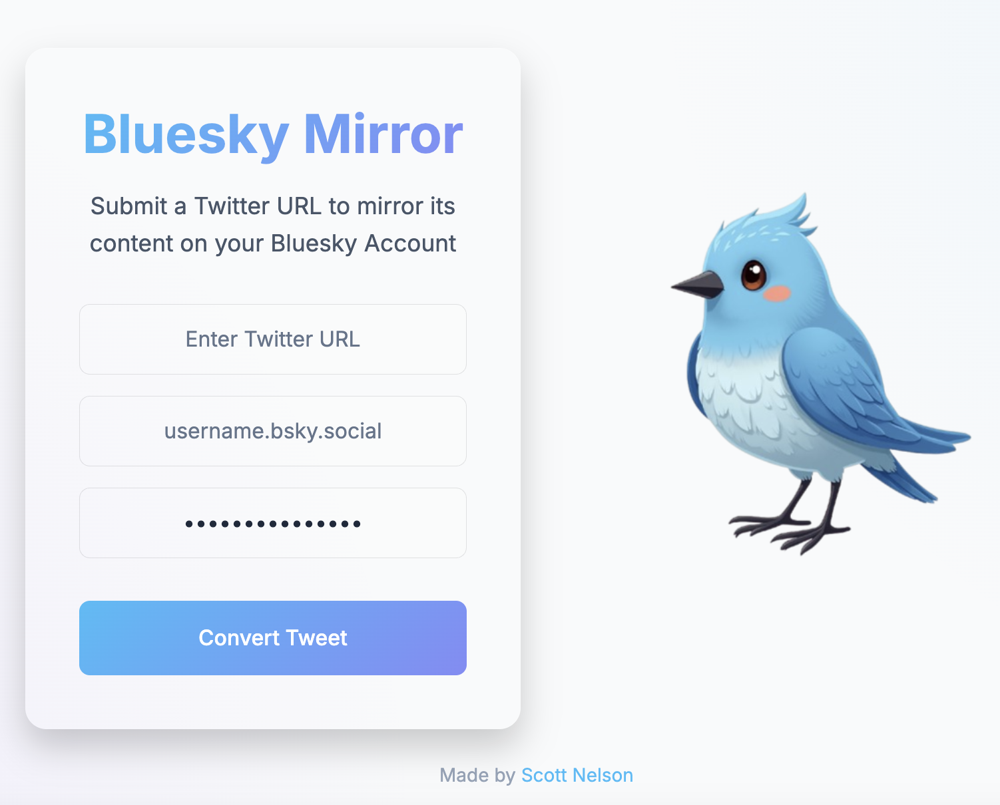

# 🐦 Bluesky Mirror 🦋

A simple tool to copy a Tweet and post it directly to Bluesky with a friendly interface.

<div align="center">



</div>

## Features

📤 **Tweet to Bluesky Posting**: Quickly repost any Tweet to Bluesky by providing its URL. 

💾 **Save Your Favorites**: Since there's no bookmarks, save your favorites in one account.

## Setup

Clone the repository:

```bash
git clone git@github.com:NelsonScott/bluesky-mirror.git
cd bluesky-mirror

make install

make dev-run
```

If you prefer to use Docker for installation:
```bash
USE_DOCKER=true make install

USE_DOCKER=true make run
```

## License

This project is licensed under the MIT License.

## Acknowledgements

* Reliable strategy scrape found @ https://scrapfly.io/blog/how-to-scrape-twitter/
* Helpful examples for BSky API @ https://github.com/MarshalX/atproto/tree/main/examples
* Built with 💻 and ☕

## TODO
* Frontend to display results and error states dynamically
* Update tags twitter content to bluesky username
* Errors should display nicely to user, not disrupt whole page
